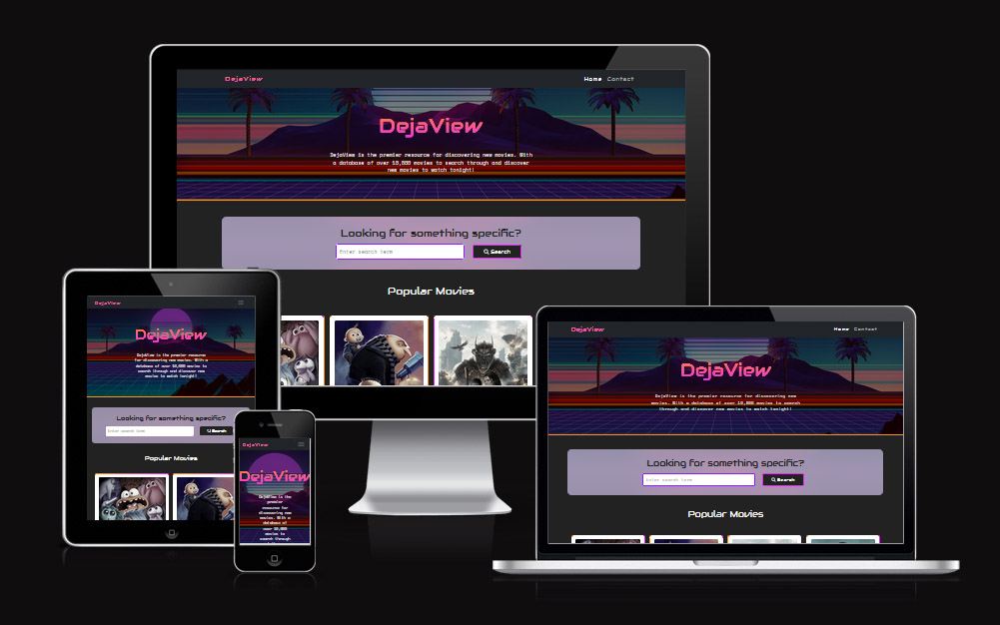
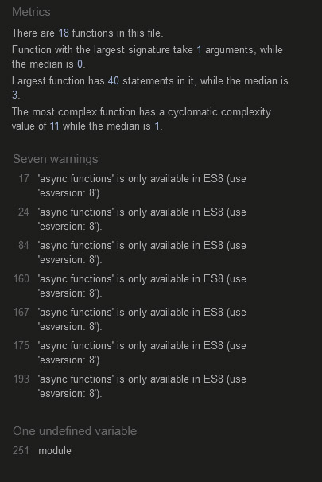
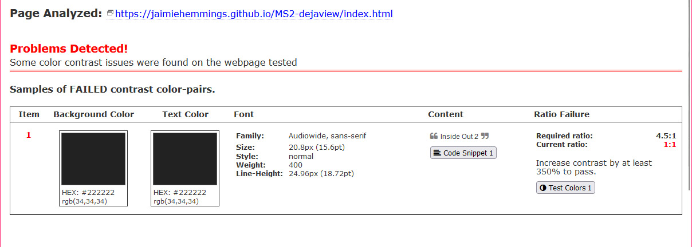
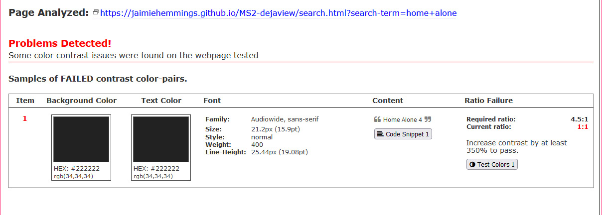
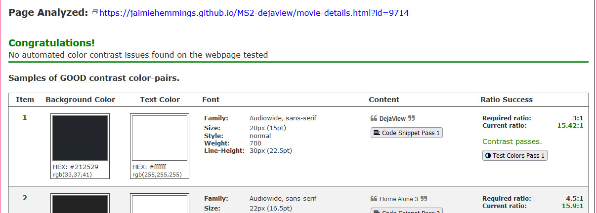
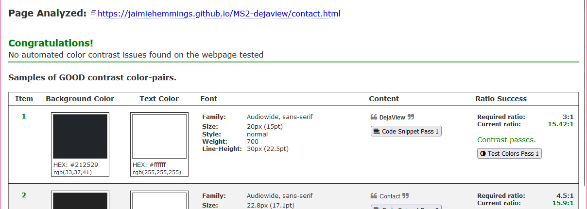
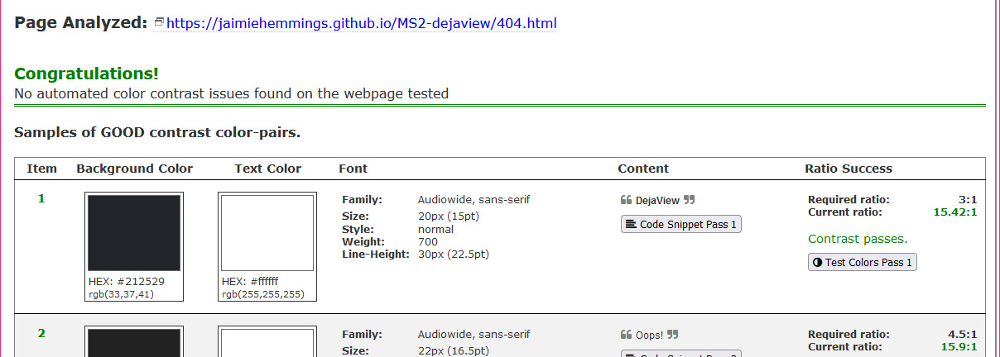
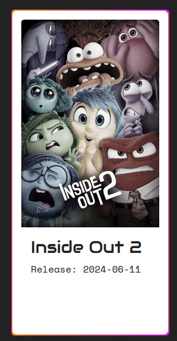

# MS2-dejaview

View the live website [here](https://jaimiehemmings.github.io/MS2-dejaview/).

DejaView is an interactive website developed to help users find new movies to enjoy based on varying criteria, whether it be recommendations based on user supplied criteria, existing reviews or randomly generated recommendations based on nothing but luck.



# Table of Content:

- [Overview](#Overview)
- [User Experience UX](#UX)
- [Features](#features)
- [Technologies Used](#TechnologiesUsed)
- [Testing](#Testing)
- [Deployment](#Deployment)
- [Credits](#Credits)
- [Acknowledgements](#Acknowledgements)

## Overview

DejaView intends to be the number one resource for finding movie recommendations or finding information about movies in general.

## <a name="UX"></a>User Experience (UX)

### Design

### First Time Visitor Goals

- As a first time visitor I want to be able to easily understand the purpose of the website
- As a first time visitor I want to be able to immediately understand how to navigate and use the website.
- As a first time visitor I expect the website to display appropriately regardless of the screen size I view it on
- As a first time visitor I want to easily ube able understand how to use the main features of the website

### Returning Visitor Goals

- As a returning visitor, I want to see a varied selection of recommended movies
- As a returning visitor, I want to be able to browse for movie recommendations with the use of a filter for things like release date or genre

### Frequent Visitor Goals

- As a frequent visitor I want to be able to easily find information about a specific movie
- As a frequent visitor I want to be able to easily navigate to a specific part of the website
- As a frequent visitor I want to be able to easily provide feedback to the site owner

### Colour Scheme

In order to make the page as bright, inviting and user friendly as possible, I will be implementing a range of bright, friendly colours while keeping text as readable as possibly by using white text on a faded black background, or white text on a faded black background.

The primary colours used will be `#ff901f`, `#f222ff` and `#8c1eff`. I will be using the "Retrowave" theme throughout the website in order to pay homage to the 80's. A decade that I, personally, feel was the prime time for movies.

### Typography

In keeping with the 80's theme, I will be using "Audiowide" as the primary font and "Space Mono" for the secondary font of the website. I feel these two fonts will allow me to keep a coherent and fitting theme throughout the website while allowing for optimal readability and careful usage of font weights will allow me to direct the user to key sections of the website.

### Imagery

The imagery of the website will feature a lot of cover art relevant to the movie for which information is being displayed.

### Wireframes

#### Homepage

- [Desktop](assets/documentation/design-mockups/homepage-desktop.png)
- [Mobile](assets/documentation/design-mockups/homepage-mobile.png)

#### Search Results Page

- [Desktop]()
- [Mobile]()

#### Contact Page

- [Desktop]()
- [Mobile]()


## Features

DejaView will feature a large search area on the homepage, allowing the user to immediately start searching by a number of filters to find either a specific movie or movie recommendations based on their filter inputs.

The website will also feature a list of recently released movies allowing the user the peruse the relevant information for that movie and then view a selection of other movies based attributes for that movie, like genre.

The user will then also be provided with a url to visit the dedicated website for that movie if they wish to find additional information.

## Technologies Used

### Languages Used

- HTML
- CSS
- JavaScript

### Frameworks, Libraries and Programmes used

- [TMDB](https://www.themoviedb.org/?language=en-GB) The API used in this website belongs to TMDB

- [CloudConvert](https://cloudconvert.com/) Was used to convert images to webp to improve performance and load times.

- [Google Fonts](https://fonts.google.com/) Were used for the typography across the site with appropriate fallbacks.

- Photoshop was used for image editing and resizing

- [Jest](https://jestjs.io/) for unit testing

- [Mock Fetch Jest](https://www.leighhalliday.com/mock-fetch-jest) plugin for Jest to mock fetch requests

- [Git](https://git-scm.com/) for version control

- [Github](https://github.com/) for hosting the repository

- [Balsamiq](https://balsamiq.com/) for creating wireframes

- [FontAwesome](https://fontawesome.com/) was used for various icons across the wesbite

- DevTools (Chrome, Edge, Firefox) for testing during development

- [Favicon Generator](https://realfavicongenerator.net/) was used to create comprehensive favicons

- [JSHint](https://jshint.com/) was used to test JavaScript code

- [a11y](https://color.a11y.com/) to test accessibility

- [W3C Markup Validation](https://validator.w3.org/) was used to test HTML code

- [W3C CSS Validation Service](https://jigsaw.w3.org/css-validator/) was used to test CSS code

## Testing

### Bugs and Solutions

#### Solved Bugs

- Due to the nature of GitHub Page hosting my initial implementation of the switch based on the current window pathname was broken. This is because when you host on Github pages, the index page is no longer hosted at the true root of the website. In order to deal with this I had to implement a `lastIndexOf' method on the pathname to correct the bug. Additionally I included additional cases as a fallback within the statement. [This](https://stackoverflow.com/questions/4758103/last-segment-of-url-with-javascript) StackOverflow answer was very helpful in determining a solution to this issue.

- When searching for a movie, if only one result was found the card for that movie would be far larger than intended. This is because the original css always assumed (on a large screen) that a minimum of four results would be returned per row. Therefore, when a single result was returned it would take up the entire container width instead of 1/4 as originally intended. This was originally discovered by a fellow CodeIntitute Learner when I was asking for feedback. In order to resolve this I implemented a `max-width` css rule to the resulting card-body.

- While speaking to my mentore, Brian, he discovered a ternary operator in my code that was malformed:
  - Original:

  ```movie.release_date ? ( tempNode.querySelector(".card-text).textContent = `Release: ${movie.release_date}` ) : ( tempNode.querySelector(".card-text).textContent = "No release date found" )```
  
  This was working as intended but I decided to correct the syntax for clarity and to maintain code hygiene.

  - Fixed:

  ``` tempNode.querySelector(".card-text").textContent = movie.release_date ? `Release: ${movie.release_date}` : "No release date found"; ```

  - Released API key: The websites core functionality is enabled by the API provided by [TMDB](https://www.themoviedb.org/?language=en-GB). A major concern was that by hosting the website on GitHub, my API key would become publicly available. This issue arises not only from the API key being publicly visible in my github repository but also by the fact it is stored in plaintext in the JavaScript files. Obfuscation of the key within my code could have helped reduce the risk here but it would still have been visible in the Network tab of any browsers DevTools. Ultimately, the API key is provided for free with very generous rates and lifetime access. For this reason I believe releasing the key publicly is a very minor concern as anyone that wants to get an API key for this service can get their own very easily.

  - While Validating my HTML using the W3C service, I discovered that I had left in place several trailing slashes on various images and stylesheet links. While this is a minor issue, I have corrected it regardless to avoid any issues with unquoted attribute values.

#### Remaining bugs

There are not any known bugs remaining.

### Validation Results

#### W3C HTML Checks

I used the W3C HTML Validator to check my HTML files and enure there were no issues.

- [Homepage](assets/documentation/w3c-html-checks/index.jpg)
- [Search](assets/documentation/w3c-html-checks/search.jpg)
- [Movie Details](assets/documentation/w3c-html-checks/movie-details.jpg)
- [Contact](assets/documentation/w3c-html-checks/contact.jpg)
- [404](assets/documentation/w3c-html-checks/404.jpg)

#### W3C CSS Checks

I used the W3C CSS Validator to check my CSS files for any major issues

- [CSS](assets/documentation/w3c-css-checks/css.jpg)

Recieving only one error, this is to do with the CSS Spinner that I took from a user on CodePen as attributed below. I have decided not to investigate this issue as the loader is a minor part of the website that should, ideally, never be displayed for more than a few milliseconds.

Additional CSS Warnings were provided, almost esclusively relating to Vendor Extensions. The full report can be found [here](https://jigsaw.w3.org/css-validator/validator?uri=https%3A%2F%2Fjaimiehemmings.github.io%2FMS2-dejaview%2Fassets%2Fcss%2Fstyle.css&profile=css3svg&usermedium=all&warning=1&vextwarning=&lang=en).

#### JSHint

In order to check my Javascript error that were not caught by VSCodes built in linter I ran my code through JSHint.



As seen in the image I recieved 7 warnings all relating to the use of my async functions with the recommendation of using `esversion: 8` on the linting software. I checked the documentation [here](https://jshint.com/docs/options/#esversion) which describes the use of a comment line at the beginning of the file in order to change the linting configuration. However after adding `/*jshint esversion: 6 */` I recieved the warning `Incompatible values for the 'esversion' and 'esnext' linting options. (0% scanned).`. I tried changing the esversion to various other values as described in the documentation with no luck as well as googling and checking StackOverflow for answers but could not get the esversion to change successfully.

#### Lighthouse Report

##### Desktop

- [Index](assets/documentation/lighthouse/index-desktop.jpg)
- [Search](assets/documentation/lighthouse/search-desktop.jpg)
- [Movie Details](assets/documentation/lighthouse/movie-details-desktop.jpg)
- [Contact](assets/documentation/lighthouse/contact-desktop.jpg)
- [404](assets/documentation/lighthouse/404-desktop.jpg)

##### Mobile

- [Index](assets/documentation/lighthouse/index-mobile.jpg)
- [Search](assets/documentation/lighthouse/search-mobile.jpg)
- [Movie Details](assets/documentation/lighthouse/movie-details-mobile.jpg)
- [Contact](assets/documentation/lighthouse/contact-mobile.jpg)
- [404](assets/documentation/lighthouse/404-mobile.jpg)

##### Conclusion

While I believe this Lighthouse report is more than acceptable I believe there is room for improvement. The biggest negative factors in my opinion, based on the report are:

- External render blocking resources
- Heavy use of images
- API Images not being delivered in next-gen formats (webp)
- Lack of caching
- Content shifts

Some of this is unavoidable, for example, the website relies heavily on the API for core functionality. However, in future, I would look into methods to improve this, such as:

- Pre-rendering the homepage with blank content then replacing it to cumulative layout shifts.
- Caching images to reduce network usage
- Lazy loading images where possible
- reducing my reliance on CDN's where possible by serving icons locally without the need for another network request.
- Reducing the amount of results per page, therefore reducing the amount of imagery on each page

#### a11y Color Contrast Accessibility

a11y was used to ensure appropriate contast between text and the text background to ensure acceptable readability and accessibility. The results are as follows:











While the index and search page had contrast issues, I believe these to be a false positive. I am not sure what caused this but after checking what I am actually seeing on these pages I see the following in relation to the highlighted issue:



The issue highlighted by a11y is dark text on a dark background, whereas what I am seeing is dark text on a bright white background that I am confident would cause no contrast issues. I am therefore putting this down to a flaw with automated testing after manually verifying it myself.

### Testing User Stories


## Deployment &amp; Local Development

- The project was deployed to Github Pages using the following steps:

1. Create and/or Log in to GitHub
2. Locate the repository within GitHub
3. Within the repository, click on Settings
4. Within the settings page locate the sub-menu on the left hand side and click on Pages
5. Under "Source" select "Branch:main" then /root
6. Click Save
7. Wait a few moments for the repository to deploy
8. At this point the repository will be deployed and ready to view

## Cloning the Repository

- Follow the steps below to clone the repository:

1. Locate the repository
2. Click the button labelled "Code" to the top right of the screen
3. Click HTTPS and copy the link provided
4. In your local environment navigate to the desired directory
5. Open a terminal and type "git clone `repository-url`"
6. Press enter to begin the cloning process

## Credits

### Content

Obviously most of the consumable content used on the website belongs to [TMDB](https://www.themoviedb.org/?language=en-GB) and I would like to thank them for creating such a comprehensive and robust API.

### Code

- [Unused CSS](https://unused-css.com/tools/border-gradient-generator) Was used to aid in the generation of border gradients.

- [Codepen](https://codepen.io/aldrie/pen/PojGYLo) For the glitch effect animation on the logo

- [StackOverflow](https://stackoverflow.com/questions/4758103/last-segment-of-url-with-javascript) For help with troubleshooting URL switch

- [Codepen](https://codepen.io/tbrownvisuals/pen/edGYvx) for the Loading Spinner

- [BootstrapBrain](https://bootstrapbrain.com/component/bootstrap-5-simple-contact-form-example/#code) for a contact form template which I customised

### Media

- [Wallhaven](https://wallhaven.cc/w/j53r1p) for image used as search form backdrop

- [PixaBay](https://pixabay.com/illustrations/city-sunset-night-landscape-urban-5848267/) for image used on contact page

## Acknowledgements

Thanks again to my mentor Brian Macharia for providing ongoing help &amp; support, the feedback he has provided has been invaluable in helping me improve as a developer. Thanks also to the Code Institute team for providing an engaging and informative learning platform.