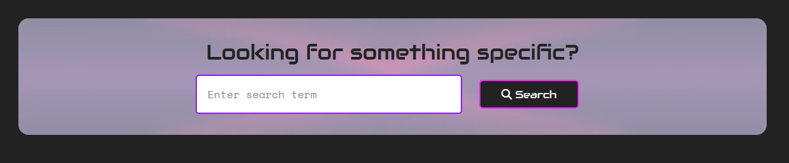
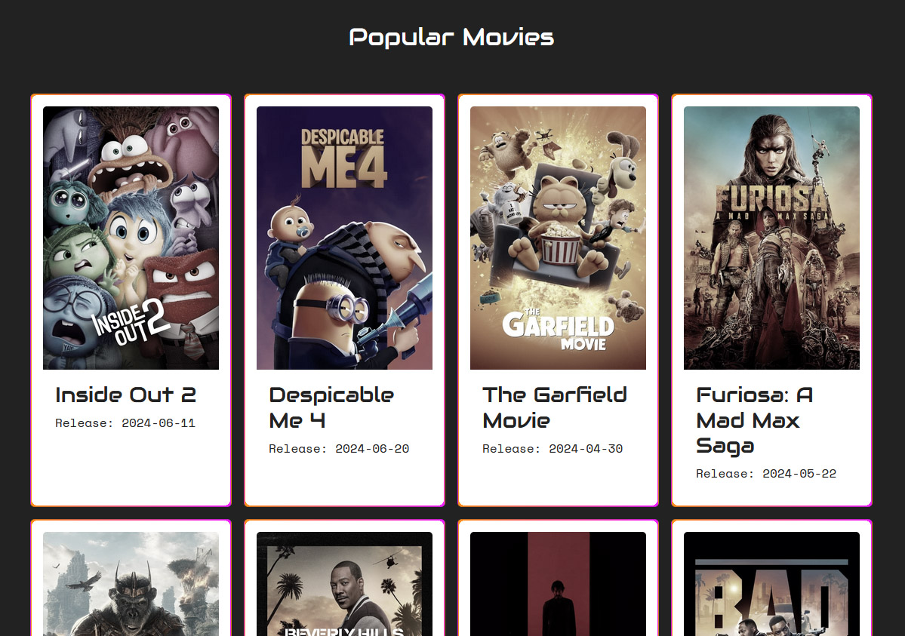
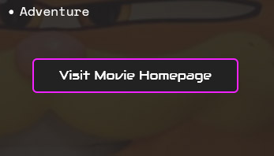
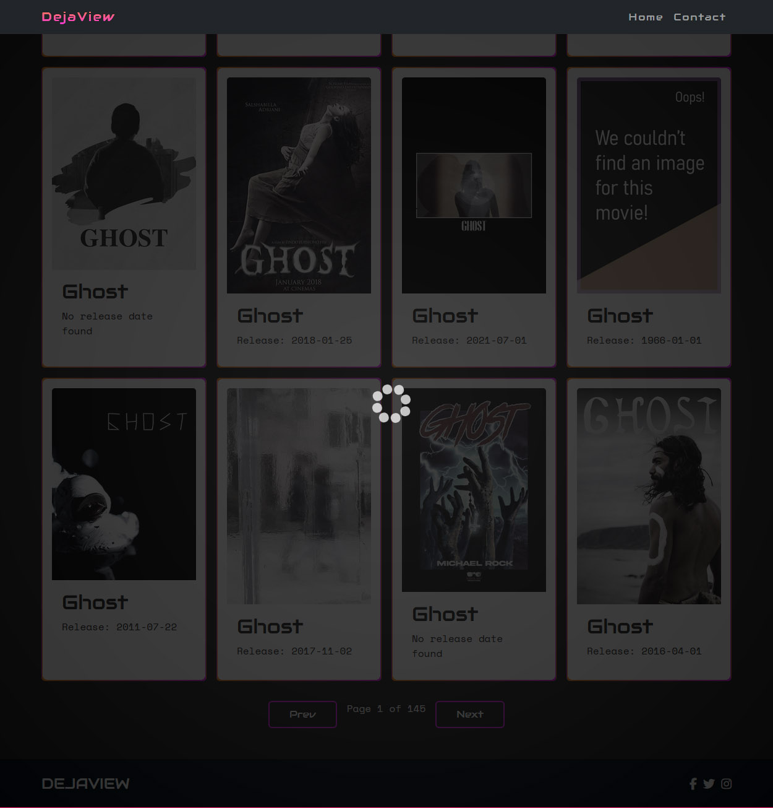
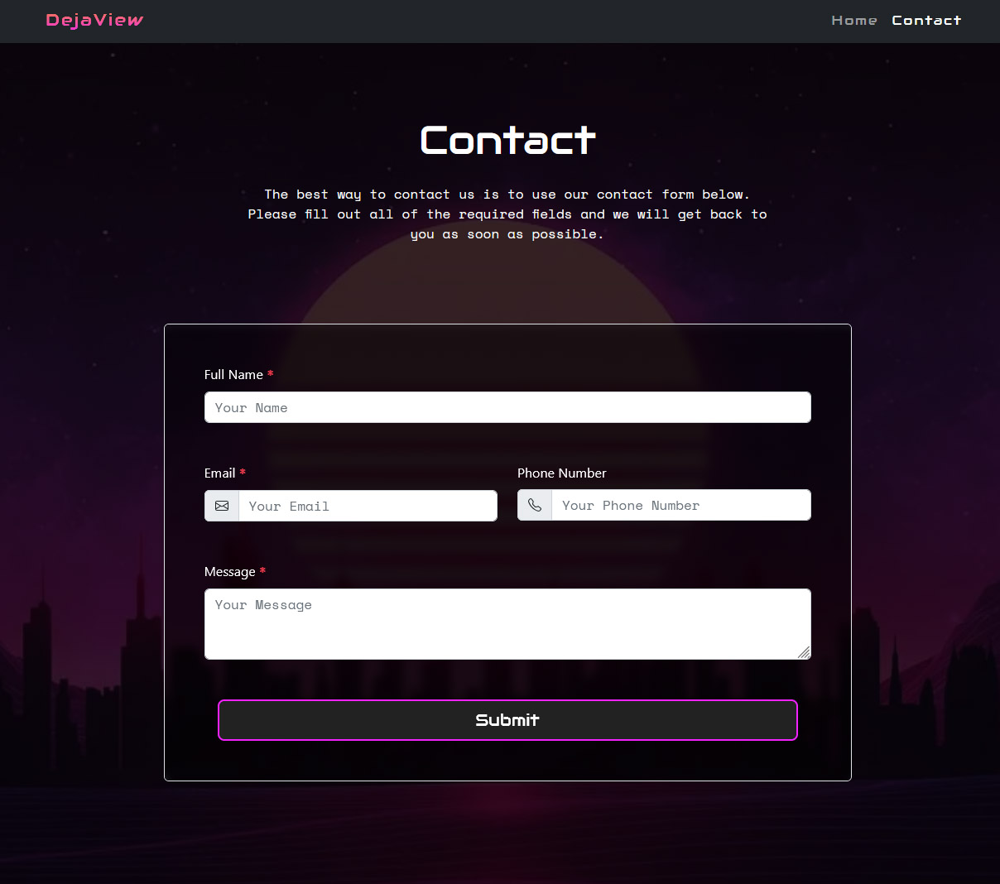
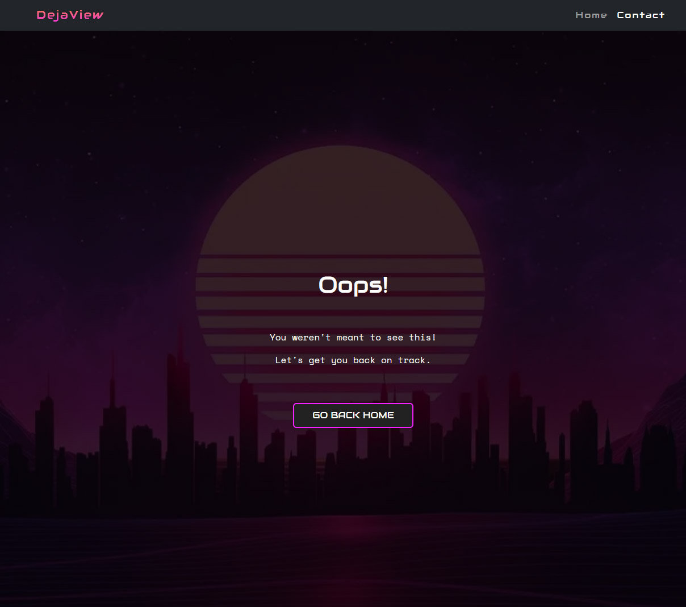

# MS2-dejaview

View the live website [here](https://jaimiehemmings.github.io/MS2-dejaview/).

DejaView is an interactive website developed to help users find new movies to enjoy based on varying criteria, whether it be recommendations based on user supplied criteria, existing reviews or randomly generated recommendations based on nothing but luck.


# Table of Content:

- [Overview](#Overview)
- [User Experience UX](#UX)
- [Features](#features)
- [Technologies Used](#TechnologiesUsed)
- [Testing](#Testing)
- [Deployment](#Deployment)
- [Credits](#Credits)
- [Acknowledgements](#Acknowledgements)

## Overview

DejaView intends to be the number one resource for finding movie recommendations or finding information about movies in general.

Dejaview intends to be able to display information on a massive library of movies, as well as suggest movies based on user selected parameters.

The target audience would be:

- Moviephiles, intending to look up additional information about a movie they have recently enjoyed
- Movie recommendations for:
  - Couple looking or a date night movie
  - Friends wanting a movie night
  - Individuals looking to browse latest movie releases

## <a name="UX"></a>User Experience (UX)

### Design

### First Time Visitor Goals

- As a first time visitor I want to be able to easily understand the purpose of the website
- As a first time visitor I want to be able to immediately understand how to navigate and use the website.
- As a first time visitor I expect the website to display appropriately regardless of the screen size I view it on
- As a first time visitor I want to easily be able understand how to use the main features of the website

### Returning Visitor Goals

- As a returning visitor, I want to see a varied selection of recommended movies
- As a returning visitor, I want to be able to browse for movie recommendations with the use of a filter for things like release date or genre

### Frequent Visitor Goals

- As a frequent visitor I want to be able to easily find information about a specific movie
- As a frequent visitor I want to be able to easily navigate to a specific part of the website
- As a frequent visitor I want to be able to easily provide feedback to the site owner

### Colour Scheme

In order to make the page as bright, inviting and user friendly as possible, I will be implementing a range of bright, friendly colours while keeping text as readable as possible by using white text on a faded black background, or white text on a faded black background.

The primary colours used will be `#ff901f`, `#f222ff` and `#8c1eff`. I will be using the "Retrowave" theme throughout the website in order to pay homage to the 80's. A decade that I, personally, feel was the prime time for movies.

### Typography

In keeping with the 80's theme, I will be using "Audiowide" as the primary font and "Space Mono" for the secondary font of the website. I feel these two fonts will allow me to keep a coherent and fitting theme throughout the website while allowing for optimal readability and careful usage of font weights will allow me to direct the user to key sections of the website.

### Imagery

The imagery of the website will feature a lot of cover art relevant to the movie for which information is being displayed.

### Wireframes

#### Homepage

- [Desktop](assets/documentation/design-mockups/homepage-desktop.png)
- [Mobile](assets/documentation/design-mockups/homepage-mobile.png)

#### Search Results Page

- [Desktop](assets/documentation/design-mockups/search-desktop.png)
- [Mobile](assets/documentation/design-mockups/search-mobile.png)

#### Contact Page

- [Desktop](assets/documentation/design-mockups/contact-desktop.png)
- [Mobile](assets/documentation/design-mockups/contact-mobile.png)


## Features

- DejaView will feature a search area on the homepage, allowing the user to immediately start searching by a number of filters to find either a specific movie or movie recommendations based on their filter inputs.
- The website will also feature a list of recently released and popular movies allowing the user the peruse the relevant information for that movie and then view a selection of other movies based attributes for that movie, like genre.
- The user will then also be provided with a url to visit the dedicated website for that movie if they wish to find additional information.
- Additionally, a loading spinner will be displayed to prevent the display of unstyled content (FOUC) which may otherwise create a jarring experience for the user.
- The user will also be able to access a contact form on the contact page which they can use to send Feedback, ideas or simply a message to the site owner.
- As well as this, a 404 page will be created in the case of the user following an expired or invalid link, this page will then help navigate the user to the homepage.

## <a name="TechnologiesUsed"></a>Technologies Used

### Languages Used

- HTML
- CSS
- JavaScript

### Frameworks, Libraries and Programmes used

- [TMDB](https://www.themoviedb.org/?language=en-GB) The API used in this website belongs to TMDB

- [CloudConvert](https://cloudconvert.com/) Was used to convert images to webp to improve performance and load times.

- [Google Fonts](https://fonts.google.com/) Were used for the typography across the site with appropriate fallbacks.

- Photoshop was used for image editing and resizing

- [Jest](https://jestjs.io/) for unit testing

- [Mock Fetch Jest](https://www.leighhalliday.com/mock-fetch-jest) plugin for Jest to mock fetch requests

- [Git](https://git-scm.com/) for version control

- [Github](https://github.com/) for hosting the repository

- [Balsamiq](https://balsamiq.com/) for creating wireframes

- [FontAwesome](https://fontawesome.com/) was used for various icons across the website

- DevTools (Chrome, Edge, Firefox) for testing during development

- [Favicon Generator](https://realfavicongenerator.net/) was used to create comprehensive favicons

- [JSHint](https://jshint.com/) was used to test JavaScript code

- [a11y](https://color.a11y.com/) to test accessibility

- [W3C Markup Validation](https://validator.w3.org/) was used to test HTML code

- [W3C CSS Validation Service](https://jigsaw.w3.org/css-validator/) was used to test CSS code

- [MDN Docs](https://developer.mozilla.org/en-US/) for cross checking broswer compatibility of Javascript and CSS code

## Testing

### Bugs and Solutions

#### Solved Bugs

- Due to the nature of GitHub Page hosting my initial implementation of the switch based on the current window pathname was broken. This is because when you host on Github pages, the index page is no longer hosted at the true root of the website. As displayed [here](assets/documentation/testing/root-url.jpg). In order to deal with this I had to implement a `lastIndexOf` method on the pathname to correct the bug. Additionally, I included additional cases as a fallback within the statement. As can be seen from lines 283-289 in the [`assets/js/script.js`](assets/js/script.js) file. [This](https://stackoverflow.com/questions/4758103/last-segment-of-url-with-javascript) StackOverflow answer was very helpful in determining a solution to this issue.

- When searching for a movie, if only one result was found the card for that movie would be far larger than intended. This is because the original css always assumed (on a large screen) that a minimum of four results would be returned per row. Therefore, when a single result was returned it would take up the entire container width instead of 1/4 as originally intended. This was originally discovered by a fellow CodeIntitute Learner when I was asking for feedback. In order to resolve this I implemented a `max-width` css rule to the resulting card-body.

- While speaking to my mentor, Brian, he discovered a ternary operator in my code that was malformed:
  - Original:

  ```movie.release_date ? ( tempNode.querySelector(".card-text).textContent = `Release: ${movie.release_date}` ) : ( tempNode.querySelector(".card-text).textContent = "No release date found" )```
  
  This was working as intended but I decided to correct the syntax for clarity and to maintain code hygiene.

  - Fixed:

  ``` tempNode.querySelector(".card-text").textContent = movie.release_date ? `Release: ${movie.release_date}` : "No release date found"; ```

- Released API key: The websites core functionality is enabled by the API provided by [TMDB](https://www.themoviedb.org/?language=en-GB). A major concern was that by hosting the website on GitHub, my API key would become publicly available. This issue arises not only from the API key being publicly visible in my github repository but also by the fact it is stored in plaintext in the JavaScript files. Obfuscation of the key within my code could have helped reduce the risk here but it would still have been visible in the Network tab of any browsers DevTools. Ultimately, the API key is provided for free with very generous rates and lifetime access. For this reason I believe releasing the key publicly is a very minor concern as anyone that wants to get an API key for this service can get their own very easily.

- While Validating my HTML using the W3C service, I discovered that I had left in place several trailing slashes on various images and stylesheet links. While this is a minor issue, I have corrected it regardless to avoid any issues with unquoted attribute values.

#### Remaining bugs

There are not any known bugs remaining.

### Validation Results

#### W3C HTML Checks

I used the W3C HTML Validator to check my HTML files and ensure there were no issues.

- [Homepage](assets/documentation/w3c-html-checks/index.jpg)
- [Search](assets/documentation/w3c-html-checks/search.jpg)
- [Movie Details](assets/documentation/w3c-html-checks/movie-details.jpg)
- [Contact](assets/documentation/w3c-html-checks/contact.jpg)
- [404](assets/documentation/w3c-html-checks/404.jpg)

#### W3C CSS Checks

I used the W3C CSS Validator to check my CSS files for any major issues

- [CSS](assets/documentation/w3c-css-checks/css.jpg)

Receiving only one error, this has to do with the CSS Spinner that I took from a user on CodePen as attributed below. I have decided not to investigate this issue as the loader is a minor part of the website that should, ideally, never be displayed for more than a few milliseconds.

Additional CSS Warnings were provided, almost exclusively relating to Vendor Extensions. The full report can be found [here](https://jigsaw.w3.org/css-validator/validator?uri=https%3A%2F%2Fjaimiehemmings.github.io%2FMS2-dejaview%2Fassets%2Fcss%2Fstyle.css&profile=css3svg&usermedium=all&warning=1&vextwarning=&lang=en).

#### JSHint

In order to check my Javascript error that were not caught by VSCodes built in linter I ran my code through JSHint.


As seen in the image I received 7 warnings all relating to the use of my async functions with the recommendation of using `esversion: 8` on the linting software. I checked the documentation [here](https://jshint.com/docs/options/#esversion) which describes the use of a comment line at the beginning of the file in order to change the linting configuration. However, after adding `/*jshint esversion: 6 */` I received the warning `Incompatible values for the 'esversion' and 'esnext' linting options. (0% scanned).`. I tried changing the esversion to various other values as described in the documentation with no luck as well as googling and checking StackOverflow for answers but could not get the esversion to change successfully.

#### Lighthouse Report

##### Desktop

- [Index](assets/documentation/lighthouse/index-desktop.jpg)
- [Search](assets/documentation/lighthouse/search-desktop.jpg)
- [Movie Details](assets/documentation/lighthouse/movie-details-desktop.jpg)
- [Contact](assets/documentation/lighthouse/contact-desktop.jpg)
- [404](assets/documentation/lighthouse/404-desktop.jpg)

##### Mobile

- [Index](assets/documentation/lighthouse/index-mobile.jpg)
- [Search](assets/documentation/lighthouse/search-mobile.jpg)
- [Movie Details](assets/documentation/lighthouse/movie-details-mobile.jpg)
- [Contact](assets/documentation/lighthouse/contact-mobile.jpg)
- [404](assets/documentation/lighthouse/404-mobile.jpg)

##### Conclusion

While I believe this Lighthouse report is more than acceptable I believe there is room for improvement. The biggest negative factors in my opinion, based on the report are:

- External render blocking resources
- Heavy use of images
- API Images not being delivered in next-gen formats (webp)
- Lack of caching
- Content shifts

Some of this is unavoidable, for example, the website relies heavily on the API for core functionality. However, in future, I would look into methods to improve this, such as:

- Pre-rendering the homepage with blank content then replacing it to reduce cumulative layout shifts.
- Caching images to reduce network usage where possible
- Lazy loading images where possible
- reducing my reliance on CDN's where possible by serving icons locally without the need for another network request.
- Reducing the amount of results per page, therefore reducing the amount of imagery on each page

#### a11y Color Contrast Accessibility

a11y was used to ensure appropriate contrast between the text and the text background to ensure acceptable readability and accessibility. The results are as follows:


While the index and search page had contrast issues, I believe these to be a false positive. I am not sure what caused this but after checking what I am actually seeing on these pages I see the following in relation to the highlighted issue:


The issue highlighted by a11y is dark text on a dark background, whereas what I am seeing is dark text on a bright white background that I am confident would cause no contrast issues. I am therefore putting this down to a flaw with automated testing after manually verifying it myself.

#### Jest Testing


My Jest tests all came back positive however my use of fetch complicated my testing as the majority of my code was embedded within the asynchronous code blocks. In order to aid me in my testing I implemented an additional package called "Jest Fetch Mock" and created a local JSON object to use in my testing.

In future I would extract the API calls to their own isolated function blocks and use callbacks to pass the data to another function to process the data and implement the DOM manipulation separately.

This would allow me to more easily isolate sections of my code to run more comprehensive unit testing with Jest.

Additionally, in future, I would wrap critical parts of my code in `try catch` statements in order to gracefully handle failures. As well as this, in future I would create separate JavaScript files for each page with only the necessary scripts for each page. In doing this I would be able to more cleanly evaluate each of the scripts in testing.

However, the Jest Unit testing combined with feedback from friends, family and fellow Code Institute Students has assured me that the Core functionality of the website is robust enough to ensure stable usability.

### Responsiveness Testing

Alongside using Devtools to ensure the design and functionality of my website remains consistent I have also tested the website on devices of varying screen sizes.

For the sake of brevity, I have included screenshots below of some of the more common device resolutions.

#### 1920 x 1080

  - [Index](assets/documentation/responsiveness/1920x1080/index.png)
  - [Search](assets/documentation/responsiveness/1920x1080/search.png)
  - [Movie Details](assets/documentation/responsiveness/1920x1080/movie-details.png)
  - [Contact](assets/documentation/responsiveness/1920x1080/contact.png)
  - [404](assets/documentation/responsiveness/1920x1080/404.png)

#### 1280 x 1040

  - [Index](assets/documentation/responsiveness/1280x1040/index.png)
  - [Search](assets/documentation/responsiveness/1280x1040/search.png)
  - [Movie Details](assets/documentation/responsiveness/1280x1040/movie-details.png)
  - [Contact](assets/documentation/responsiveness/1280x1040/contact.png)
  - [404](assets/documentation/responsiveness/1280x1040/404.png)

#### 768 x 1024

  - [Index](assets/documentation/responsiveness/768x1024/index.png)
  - [Search](assets/documentation/responsiveness/768x1024/search.png)
  - [Movie Details](assets/documentation/responsiveness/768x1024/movie-details.png)
  - [Contact](assets/documentation/responsiveness/768x1024/contact.png)
  - [404](assets/documentation/responsiveness/768x1024/404.png)

#### 375 x 667

  - [Index](assets/documentation/responsiveness/375x667/index.png)
  - [Search](assets/documentation/responsiveness/375x667/search.png)
  - [Movie Details](assets/documentation/responsiveness/375x667/movie-details.png)
  - [Contact](assets/documentation/responsiveness/375x667/contact.png)
  - [404](assets/documentation/responsiveness/375x667/404.png)

### Browser Testing

In order to ensure I maximised the functionality of the website across all of the major browsers I fully navigated and tested all functionality across Edge, Firefox and Chrome. Unfortunately, I do not have access at this time to test in Safari. However, I have been careful to ensure that the code I used is not explicitly incompatible with Safari by checking with [MDN Docs](https://developer.mozilla.org/en-US/)

- [Firefox](assets/documentation/broswers/firefox.jpg)
- [Edge](assets/documentation/broswers/edge.jpg)
- [Chrome](assets/documentation/broswers/chrome.jpg)

### Testing User Stories

### First Time Visitor Goals

- As a first time visitor I want to be able to easily understand the purpose of the website
  - I believe this has been undoubtedly achieved by the use of the Hero section at the top of the homepage. This is the first thing a user sees upon navigating to the website and it explains the basic functionality and purpose of the website. Immediately proceeding this is a search bar allowing the user to make use of the primary purpose of the website.

- As a first time visitor I want to be able to immediately understand how to navigate and use the website.
  - As a user browses the website, an effort has been made to ensure the navigation bar remains fixed in place at the top of the screen. Not only does this help ensure that the navigation menu is always easily accessible but also readily visible should the user ever need to use it.

- As a first time visitor I expect the website to display appropriately regardless of the screen size I view it on
  - Thorough testing has been done to ensure that the website always displays content appropriately regardless of screen size as has been documented in my testing.

- As a first time visitor I want to easily be able to understand how to use the main features of the website
  - The main feature of the website, a search bar to look up movie information, takes a prominent position on the homepage of the website and is one of the first things a user sees with a prompt encouraging them to use it. Additionally, below this is a list of popular movies generated through the use of an API. This allows the user to become familiar with the features of the website by clicking on any of the popular movies to familiarise themselves with the purpose and functions of the website.

### Returning Visitor Goals

- As a returning visitor, I want to see a varied selection of recommended movies
  - When a user visits the homepage of the website, a list of popular movies is displayed to them, allowing them to click on any of these and engage with the main functionality of the website - exploring movies and obtaining additional information about them.

- As a returning visitor, I want to be able to browse for movie recommendations with the use of a filter for things like release date or genre
  - using the search form to explore movies does provide some limited functionality in this regard however additional functionality to support would be a great thing to develop going forwards.

### Frequent Visitor Goals

- As a frequent visitor I want to be able to easily find information about a specific movie
  - I believe I have easily satisfied this goal with the core functionality of this website. The method by which the website is navigated is easy and intuitive and allows the user to search for any phrase they like in order to find related movies and explore information about those movies.

- As a frequent visitor I want to be able to easily navigate to a specific part of the website
  - I believe I have made website navigation easy and intuitive by following UX conventions that conform to what most users now have come to expect from a website.

- As a frequent visitor I want to be able to easily provide feedback to the site owner
  - A contact form on the contact page allows the user to submit feedback or contact the site owner directly.

### Feature Testing

- DejaView will feature a search area on the homepage, allowing the user to immediately start searching by a number of filters to find either a specific movie or movie recommendations based on their filter inputs.
  - 
  - The search bar takes a prominent and easily discoverable position on the homepage. However, the aforementioned filters allowing searching by things like genre and release date were not included in the scope of the initial deployment and would be developed in the next stage of development.

- The website will also feature a list of recently released and popular movies allowing the user the peruse the relevant information for that movie and then view a selection of other movies based attributes for that movie, like genre.
  - 
  - Below the search bar, in an easy to find location on the homepage is a list of popular movies. An additional section for recently released movies was postponed for this deployment of the project due to the scope of exisiting features.

- The user will then also be provided with a url to visit the dedicated website for that movie if they wish to find additional information.
  - 
  - On the Movies Details page of each movie, a link is displayed allow the user to visit a dedicated webpage for that movie where one exists.

- Additionally, a loading spinner will be displayed to prevent the display of unstyled content (FOUC) which may otherwise create a jarring experience for the user.
  - 
  - While awaiting API fetch requests, a loading spinner is displayed on the page to indicate to the user that the page is still loading.

- The user will also be able to access a contact form on the contact page which they can use to send Feedback, ideas or simply a message to the site owner.
  - 
  - A dedicated Contact page displays a contact form allowing the user to submit a message for feedback or otherwise to the site owner/developer.

- As well as this, a 404 page will be created in the case of the user following an expired or invalid link, this page will then help navigate the user to the homepage.
  - 
  - A 404 page exists that the user is directed to upon following a dead link, this page help redirect the user to a useful area of the website to continue with their activities.

### Future Development

In continued development of this website I would like to make a few changes to the website.

- Custom thank you page upon completion of the contact form
- Refactor the Script.js file to achieve the following
  - Seperate the API fetch functions from the data processing functions
  - implement more comprehensive Jest testing
- Implement additional search functionality to allow searching by filters such as Genre

## <a name="Deployment"></a>Deployment &amp; Local Development

- The project was deployed to Github Pages using the following steps:

1. Create and/or Log in to GitHub
2. Locate the repository within GitHub
3. Within the repository, click on Settings
4. Within the settings page locate the sub-menu on the left hand side and click on Pages
5. Under "Source" select "Branch:main" then /root
6. Click Save
7. Wait a few moments for the repository to deploy
8. At this point the repository will be deployed and ready to view

## Cloning the Repository

- Follow the steps below to clone the repository:

1. Locate the repository
2. Click the button labelled "Code" to the top right of the screen
3. Click HTTPS and copy the link provided
4. In your local environment navigate to the desired directory
5. Open a terminal and type "git clone `repository-url`"
6. Press enter to begin the cloning process

## Credits

### Content

Obviously, most of the consumable content used on the website belongs to [TMDB](https://www.themoviedb.org/?language=en-GB) and I would like to thank them for creating such a comprehensive and robust API.

### Code

- [Unused CSS](https://unused-css.com/tools/border-gradient-generator) Was used to aid in the generation of border gradients.

- [Codepen](https://codepen.io/aldrie/pen/PojGYLo) For the glitch effect animation on the logo

- [StackOverflow](https://stackoverflow.com/questions/4758103/last-segment-of-url-with-javascript) For help with troubleshooting URL switch

- [Codepen](https://codepen.io/tbrownvisuals/pen/edGYvx) for the Loading Spinner

- [BootstrapBrain](https://bootstrapbrain.com/component/bootstrap-5-simple-contact-form-example/#code) for a contact form template which I customised

### Media

- [Wallhaven](https://wallhaven.cc/w/j53r1p) for image used as search form backdrop

- [PixaBay](https://pixabay.com/illustrations/city-sunset-night-landscape-urban-5848267/) for image used on contact page

## Acknowledgements

Thanks again to my mentor Brian Macharia for providing ongoing help &amp; support, the feedback he has provided has been invaluable in helping me improve as a developer. Thanks also to the Code Institute team for providing an engaging and informative learning platform.